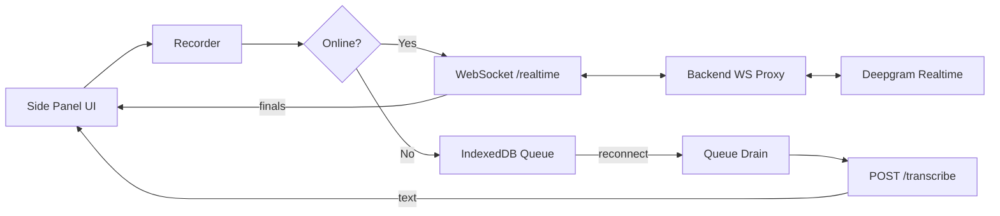
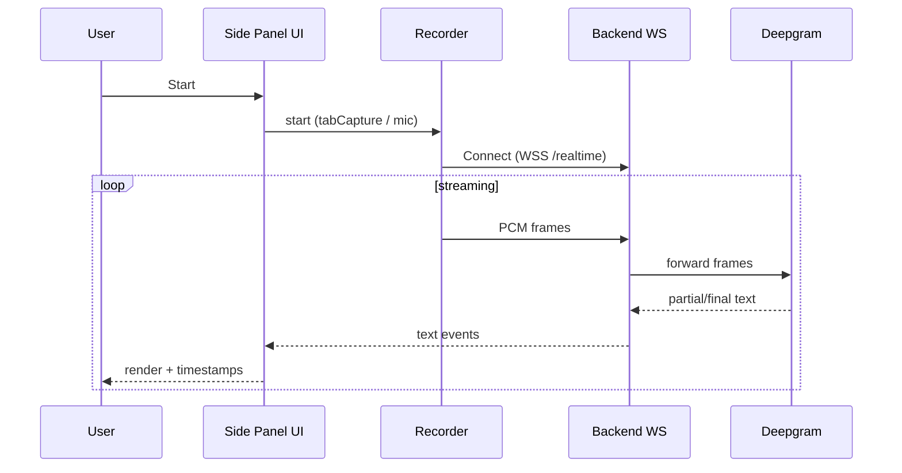
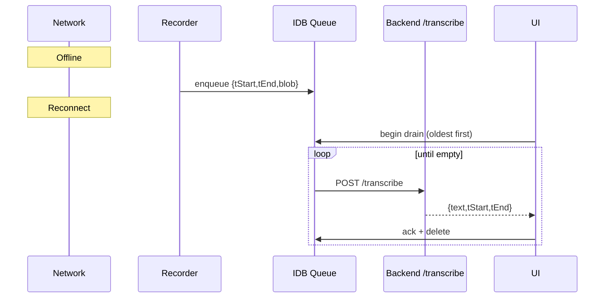
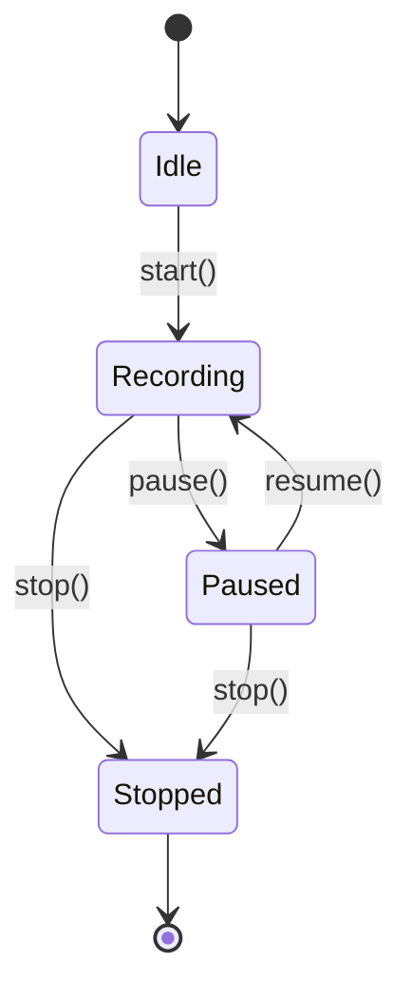

# Live Transcriber – Architecture

This document explains how the Chrome side-panel extension works: components, online vs. offline flows, queue drain, ordering, and the backend bridge.

---

## Overview

**Goal:** Transcribe the current tab (or mic) in real time, survive flaky/offline networks by queuing audio locally, and flush the backlog **first** on reconnect — all from a Chrome **Side Panel** UI.

**Key properties**

* Works online (WebSocket → Deepgram) and offline (chunked POST replay).
* Time-anchored lines with click-to-seek in the tab.
* Strict ordering & de-duplication when mixing live and replayed text.
* Minimal permissions with clear justifications.

---

## Components

| Component     | Responsibility                                                               |
| ------------- | ---------------------------------------------------------------------------- |
| Side Panel UI | User controls, transcript rendering, exporting, retries/backoff              |
| Recorder      | Captures audio (tabCapture/mic) using MediaRecorder → WAV chunks             |
| IDB Queue     | IndexedDB store for offline chunks `{ tStart, tEnd, blob }`                  |
| Queue Drain   | On reconnect, POSTs oldest chunks first to `/transcribe`                     |
| WS Proxy      | `wss:/realtime` proxy that forwards audio frames to Deepgram                 |
| Deepgram      | Realtime STT with partial/final messages                                     |
| Merge Layer   | Merges live (WS) and replay (POST) text in timestamp order, dedupes overlaps |

---

## High-level diagram



---

## Online (WebSocket) sequence



**Notes**

* UI prefers WS when network is healthy.
* Partial messages are rendered muted; **finals** replace/commit.
* If WS stalls (timeout/backoff), UI switches to **fallback** and starts queuing chunks locally.

---

## Offline fallback + drain



**Rules**

* Chunks have monotonic `tStart/tEnd` from the recorder clock.
* On reconnect, **drain first** before resuming live WS text (or interleave but always display replay text first).
* If IndexedDB is unavailable (quota/blocked), queue falls back to an in-memory ring buffer; banner shows “Queued in memory (IDB unavailable)”.

---

## Recorder state machine



---

## Data model

### IndexedDB object store: `chunks`

```ts
type ChunkRow = {
  id: string;          // ulid()
  tStart: number;      // ms since capture start
  tEnd: number;        // ms since capture start
  sampleRate: number;  // e.g. 48000
  channels: 1;         // mono
  wavBlob: Blob;       // audio/wav PCM
  size: number;        // bytes
  createdAt: number;   // Date.now()
};
```

**Indexes**

* `by_tStart` – for FIFO drain
* `by_createdAt` – maintenance/cleanup if needed

### Text line

```ts
type Line = {
  id: string;        // ulid()
  t: number;         // mm:ss display anchor (rounded)
  tStart: number;    // ms (ordering & seeking)
  tEnd: number;      // ms
  text: string;      // normalized
  source: 'ws' | 'replay';
  seq: number;       // per-source increment to break ties
};
```

---

## Ordering & de-duplication

1. UI keeps a small **staging window** (e.g., last 8–12s).
2. Incoming `Line` objects insert by `(tStart, sourcePriority, seq)`.
3. **Replay** lines (drain) take precedence over WS partials in the same window.
4. Overlap within ±1.2s is coalesced (trim repeating prefixes/suffixes).
5. Once a line is older than the window and a **final** exists, it’s committed.

---

## Backend API

Base: `https://live-transcriber-0md8.onrender.com`

* `GET /health` → `{ ok, version, model }`
* `WS /realtime` → forward frames to Deepgram; stream partial/finals back
* `POST /transcribe` → `multipart/form-data` WAV chunk + `{ tStart, tEnd, sampleRate }`
  responds `{ text, tStart, tEnd }`

**Timeouts/backoff**

* WS connect timeout \~6–8s → on failure, queue fallback.
* POST timeout \~10–12s; exponential backoff (cap \~30s).
* On 500/502/503 → requeue and continue.

---

## Timestamps & seeking

* Each line carries `tStart/tEnd`; badge shows `mm:ss`.
* Clicking a timestamp injects a tiny one-shot content script to set
  `HTMLMediaElement.currentTime = tStart / 1000` on the active tab’s main player.
* If no media element is found, the UI shows a hint; nothing persists.

---

## Permissions mapping (Chrome)

| Permission   | Why it’s needed                                                     |
| ------------ | ------------------------------------------------------------------- |
| `tabCapture` | Capture audio from the current tab                                  |
| `activeTab`  | One-time access to the active tab to seek media on click            |
| `sidePanel`  | Host the UI in Chrome’s side panel                                  |
| `scripting`  | Inject a tiny one-shot seeker script (no persistent content script) |
| `storage`    | Save settings and small metadata; transcript is export-only         |

**Host permissions:** none blanket; backend is fixed (`onrender.com`) and CORS allows `chrome-extension://*`.

---

## Failure modes

* **IDB quota/blocked** → in-memory queue; warn user; continue
* **Render cold-start** → WS/POST timeouts queue; drain when healthy
* **Network flaps** → recorder continues; chunks roll; UI toggles banners
* **Deepgram errors** → proxy surfaces codes; UI retries or falls back to POST

---

## Security & privacy

* Audio is sent only to your backend.
* Offline audio is temporary; deleted after successful transcription.
* No analytics; no third-party data sharing.

---

## Build & packaging (short)

* `dist/` holds the unpacked extension; zip as `Live-Transcriber.zip`.
* No remote code execution from CDNs; all code ships with the CRX.

---

## Review/compliance notes

* Single, narrow purpose: transcribe active tab or mic and show time-anchored text.
* Broad host permissions avoided; `activeTab` is user-initiated.
* No remote scripts; backend is data-only.
